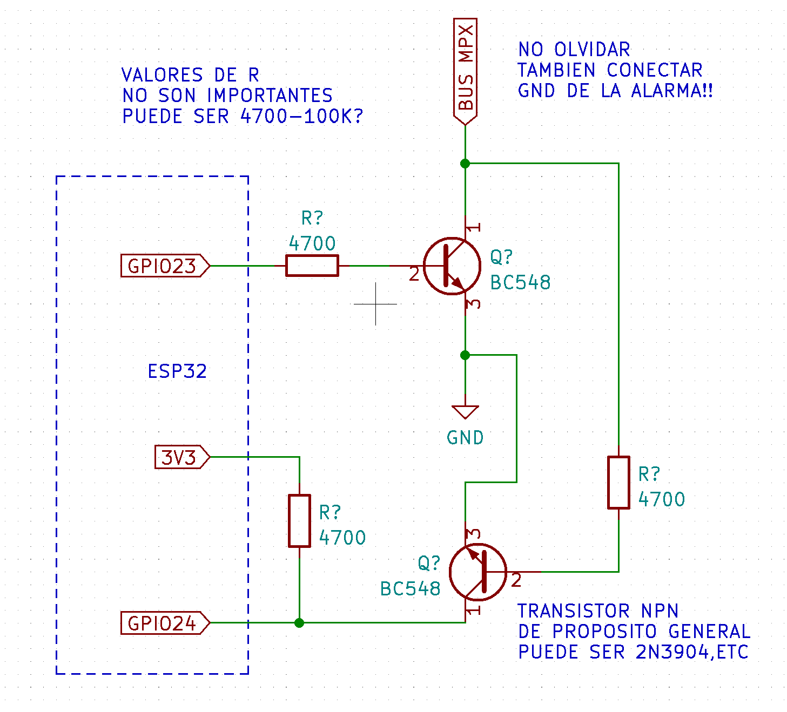

# Example: X-28 Alarm via ESPHome

This directory contains an example YAML configuration and circuit diagram for using the `x28_alarm` component.

## Circuit

The circuit connects an ESP32 to the X-28 alarm MPX bus via a level shifter and line driver.

## Usage

See the full documentation at [docs/definition.md](../docs/definition.md) for all available services, or reference the main [README.md](../README.md) for installation.
